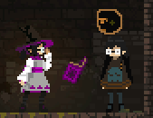
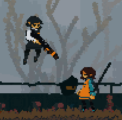
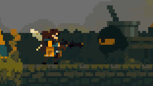
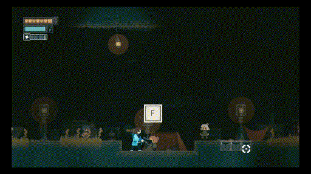
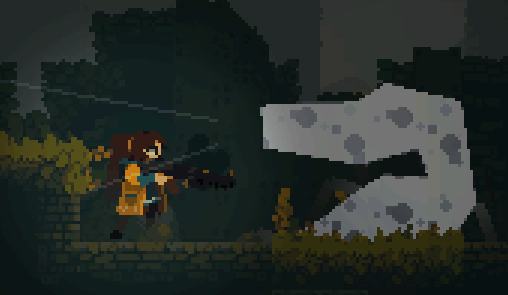
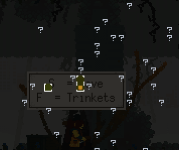
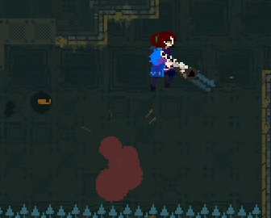

# Rusted Moss Mod Database

Data source for [Rusted Moss Mod Manager](https://github.com/Harlem512/rm-mod-manager). Most of these mods can be downloaded in-game, once it's installed.

You can check out my [modding documentation](https://harlem512.github.io/rm-docs/) for information on how this works or how to install RMML. Example mods are included in the `demo` folder.

Here's all the (publicly) included mods:

# Archipelago Client (MrL)

The Archipelago Client for use with the [Archipelago randomizer](https://archipelago.gg/). View setup/usage information at [MrL's repo](https://github.com/dgrossmann144/RustedMossArchipelagoClient).

# Maya and Ameli Palette

Lets you customize the color palette for Maya and Ameli, like you can with Fern. Edit `mods/rmml/{name}/palette.png` with your colors, similar to Fern. Example palettes and a list of what each color means is included.

Each mod is installed and managed separately, but can be installed together.

# Minify!

Makes Fern 50% smaller and 30% faster. Applies to _all_ Fern saves, yes all of them.

# Minimap

Adds a minimap to the bottom-left of the screen.

# Puntable

Makes all NPCs grapple-able by the player.

# Pursuit

Rusted Moss but there's a _cool guy_ chasing you the whole time. **_RUN_**.

# Checklist

Adds icons to the map for each pickup you haven't collected. Works with Minimap!

# Gimmick

Aprils Fools joke mod for 2025. Replaces (most) movement upgrades with additional mid-air jumps and forces the player to use the bolt caster.
